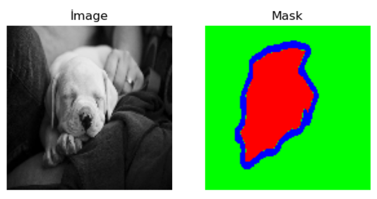
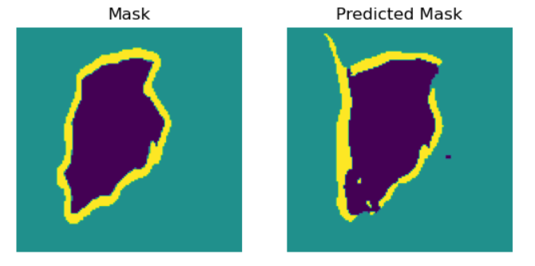

# Pet Image Segmentation using UNet

This repository contains Python code for training and testing a pet image segmentation model using the UNet architecture. The model is trained on the Oxford-IIIT Pet Dataset, which includes images of pets and corresponding segmentation masks. The code is divided into several sections for data loading, model definition, data preprocessing, model training, visualization of training history, and result visualization.

## Step1 Load Data
The training data is loaded and processed as follows: Images are read, resized, normalized, and converted into a NumPy array. Similarly, masks for segmentation are processed and converted into a separate NumPy array.

The processed data is then saved to the "numpy_array" folder.

## Step2 U-Net&Train
A Unet-type model is defined using TensorFlow and Keras. The architecture and layers of the model are specified.

The data is preprocessed: Masks are converted to categorical (one-hot) encoding, and necessary data splits are performed.

The model is compiled, and the training process is initiated. The training process occurs over a specified number of epochs. During training, loss and accuracy metrics are monitored.

The training results are visualized using the recorded metrics during training.

Training and validation loss and accuracy graphs are generated.

The trained model is saved as "final_model.h5."

# Step3 Test
Using the trained model, segment the test data and visualize the results.

Test data is loaded, and the model is loaded.

Predictions are made on the test data using the model, and the results are displayed.

  

  

  

## Dataset
The Oxford-IIIT Pet Dataset1
https://www.robots.ox.ac.uk/~vgg/data/pets/